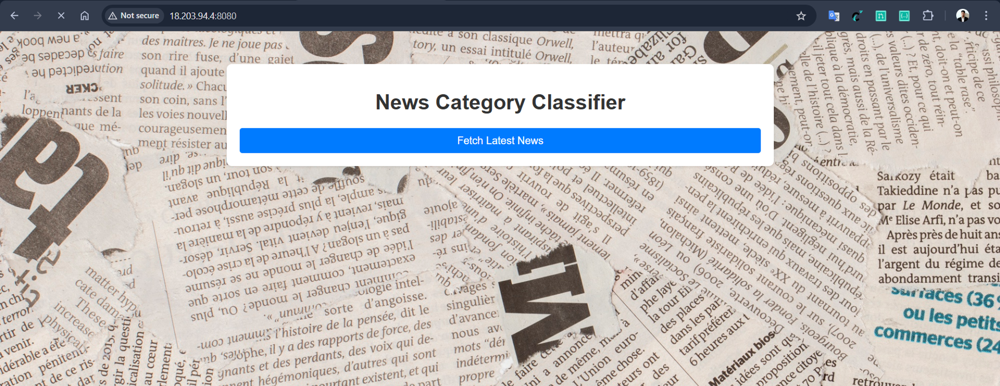
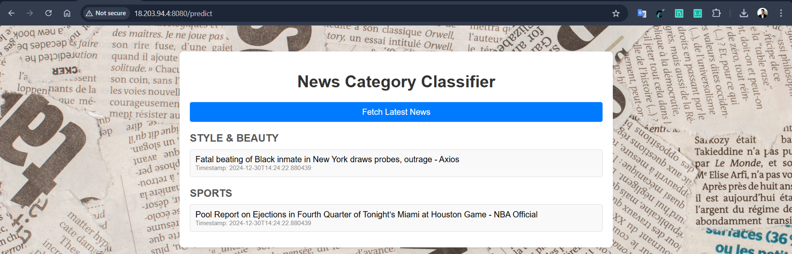
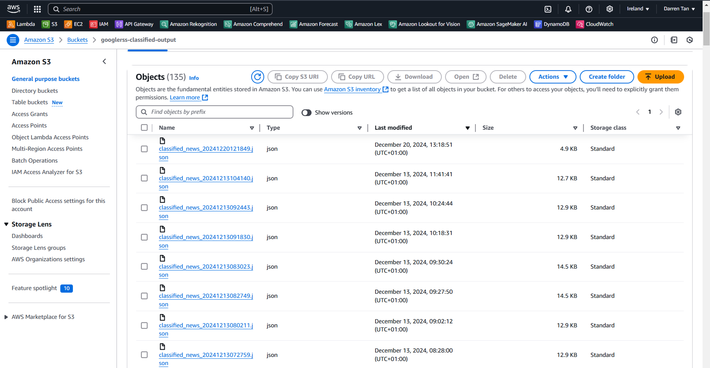
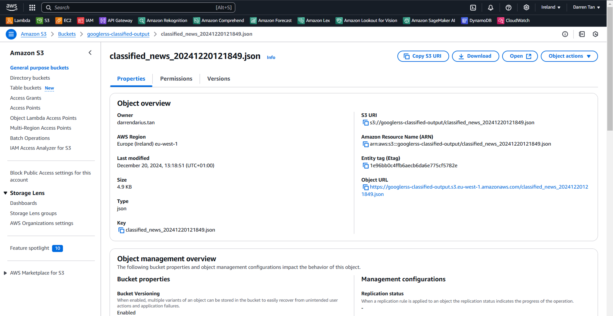
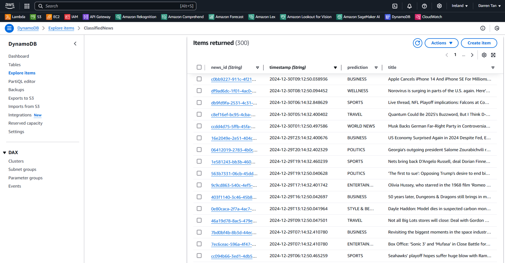
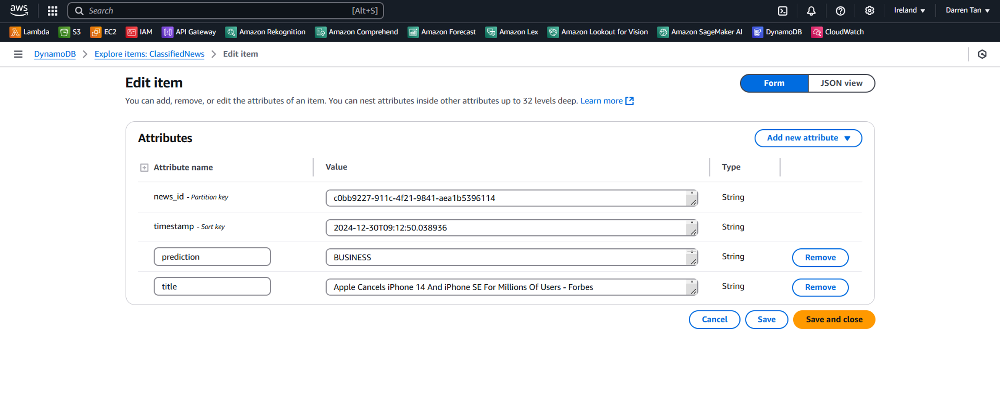

# NLP_Cloud_News_Classifier

> **Try the live News Classifier here:** [https://news-classifier.darrendarius.site/](https://news-classifier.darrendarius.site/)

---

Training an NLP model to classify news into 10 categories, embedding the model in a Python Flask Web App interface and deploying it onto AWS Cloud Services.

# Please refer to the attached PPT for full details

### Main Interface of News Classifier on AWS Cloud Services
Sample Interface after launching the files on the Gateway API provided by AWS EC2 and Python Flask app

### Main Interface of Hourly Classified News Predictions
Fetching and Classifying Real Time News of the Past Hour
*Source: Google RSS News Feed: https://news.google.com/rss?hl=en-US&gl=US&ceid=US:en 

**Note: Screenshot taken on 30 December 2023 1200h. News report count seemed to dwindle a lot at the end of the year

### Back-End Stored Fetched News in S3 (Retrieving Fetched News)
Sample Overview of S3 Archiving all Fetched News clicked on the main web-app interface

Sample Drilldown of how one of the fetched news is stored at the recorded timestamp

### Back-End Classified News Stored and Updated Automatically after 1st record of News in DynamoDB (For Completeness of Classified News)
Sample Overview of all News Articles Classified Automatically on DynamoDB Hourly

Sample Drilldown of one line item when news is parsed from Google RSS News and classified into DynamoDB Database

